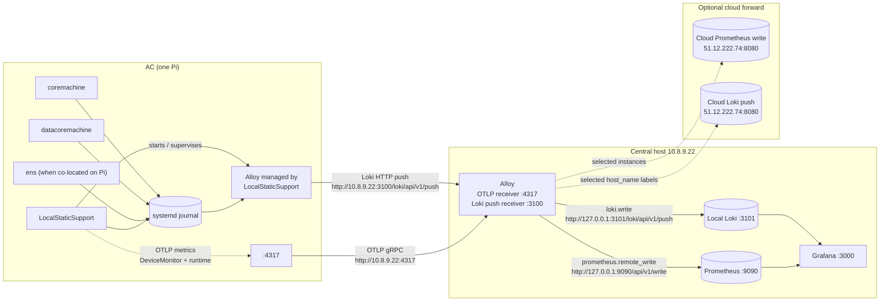
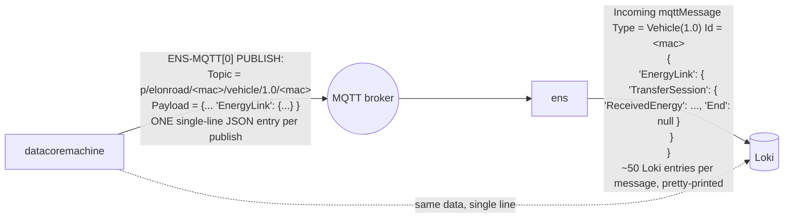
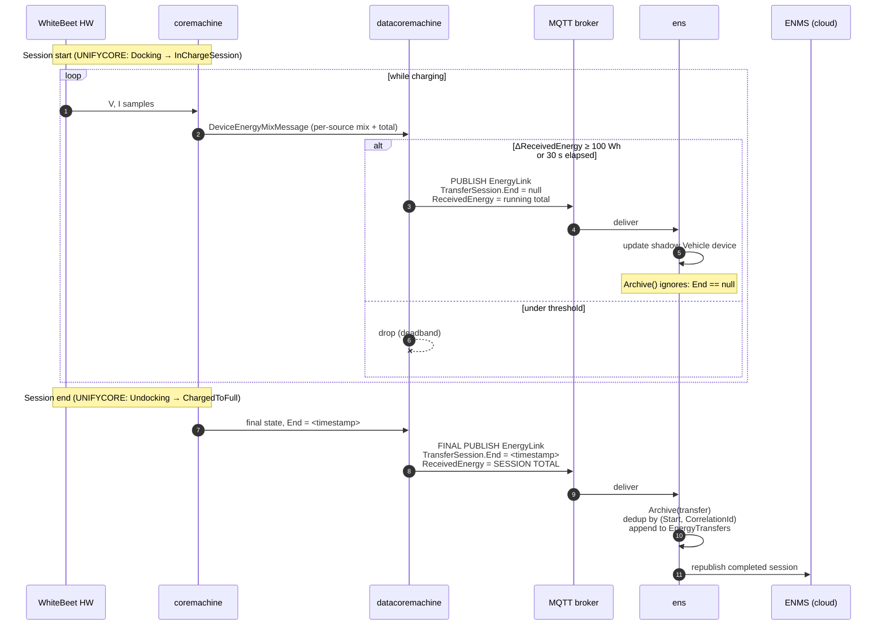

# Energy Consumption Flow

How a charging-energy reading is generated, packaged, transported, persisted, and observed across the ElonRoad platform. Diagrams use Mermaid; ASCII is used where layout matters more than topology.

## 1. End-to-end pipeline — who generates what

```
   ╔══════════════════════════════════════════════════════════════╗
   ║                       THE AC (one vehicle)                   ║
   ║                                                              ║
   ║   ┌──────────────────┐                                       ║
   ║   │ Battery + DC link│  (physical world)                     ║
   ║   └────────┬─────────┘                                       ║
   ║            │ volts, amps                                     ║
   ║            ▼                                                 ║
   ║   ┌──────────────────┐                                       ║
   ║   │   WhiteBeet HW   │  measures V, I → cumulative energy    ║
   ║   │ (ISO 15118 / V2G)│                                       ║
   ║   └────────┬─────────┘                                       ║
   ║            │ DeviceEnergyMixMessage  (per-source mix + total)║
   ║            ▼                                                 ║
   ║   ┌──────────────────┐                                       ║
   ║   │   coremachine    │  authoritative LOCAL view             ║
   ║   │ (state machine,  │  emits WHITEBEET[0] / UNIFYCORE[0]    ║
   ║   │  WhiteBeet driver│  log lines                            ║
   ║   └────────┬─────────┘                                       ║
   ║            │ SignalR (local IPC)                             ║
   ║            ▼                                                 ║
   ║   ┌──────────────────┐                                       ║
   ║   │ datacoremachine  │  applies the contract                 ║
   ║   │ "the publisher"  │  ➜ wraps as EnergyLink.TransferSession║
   ║   │                  │  ➜ deadband: only publish if          ║
   ║   │                  │     ΔReceivedEnergy ≥ 100 Wh          ║
   ║   │                  │  ➜ 30 s heartbeat regardless          ║
   ║   └────────┬─────────┘                                       ║
   ║            │ MQTT PUBLISH                                    ║
   ╚════════════│═════════════════════════════════════════════════╝
                │ topic: p/elonroad/<mac>/vehicle/1.0/<mac>
                ▼
        ╔══════════════════╗
        ║   MQTT  BROKER   ║   in prod: ens.EncryptedMqttServer
        ║  (fan-out only,  ║   in dev sample: Azure Event Grid
        ║   no processing) ║
        ╚════════╤═════════╝
                 │
                 ▼
   ╔══════════════════════════════════════════════════════════════╗
   ║                  ENS HOST  (one per energy network)          ║
   ║                                                              ║
   ║   ┌──────────────────────────────────────────────┐           ║
   ║   │                    ens                       │           ║
   ║   │  (Energy Network Server)                     │           ║
   ║   │                                              │           ║
   ║   │   • subscribes to broker                     │           ║
   ║   │   • shadow device per AcDc/Rail/Vehicle      │           ║
   ║   │   • persists EnergyTransfers (closed         │           ║
   ║   │     sessions archived when End != null)      │           ║
   ║   │   • republishes northbound to ENMS           │           ║
   ║   └─────────────────────┬────────────────────────┘           ║
   ╚═════════════════════════│════════════════════════════════════╝
                             │ MQTT upstream
                             ▼
                     ╔════════════════╗
                     ║      ENMS      ║   cloud-side aggregator
                     ║   (the cloud   ║   across many networks
                     ║    platform)   ║   and tenants
                     ╚════════════════╝
```

The arrows that matter most for "where is the energy number created":

- **Measured** at WhiteBeet HW.
- **Owned** by `coremachine` (local authoritative state).
- **Contracted and published** by `datacoremachine` (deadband + heartbeat).
- **Persisted and archived** by `ens` (per-network system of record).
- **Aggregated** at ENMS in the cloud.

## 2. When does an energy MQTT message actually go out

Energy publishes are **change-driven with a 100 Wh deadband**, backed by a 30 s heartbeat.

```
   Time ──────────────────────────────────────────────────────────►

   Cumulative
   ReceivedEnergy
   (Wh)
   ▲
   │                                                          ●  600
   │                                                       ●     500
   │                                              ●               400
   │                                       ●                      300
   │                              ●                               200
   │                       ●                                      100
   │                ●                                                0
   ●───●───●───●───┘
   0   0   0   0
   └──────┬────┘  └──┬───┘   └──┬───┘   └──┬──┘  └──┬──┘  └──┬──┘
       idle:        100 Wh    100 Wh     100 Wh    100 Wh   100 Wh
   only 30 s      crossed →   crossed →  crossed → ...     ...
   heartbeat      PUBLISH     PUBLISH    PUBLISH
   publishes      EnergyLink  EnergyLink EnergyLink
```

**Rule:**

> PUBLISH(EnergyLink) IF `|ΔReceivedEnergy| ≥ 100 Wh` OR if 30 s have elapsed since the last full publish.

**Practical cadence:**

| Charging power | Time to accumulate 100 Wh | Energy publish cadence |
| --- | --- | --- |
| 10 kW | 36 s | dominated by 30 s heartbeat |
| 25 kW | 14 s | ~14 s |
| 50 kW | 7.2 s | ~7 s |
| 100 kW | 3.6 s | ~4 s |
| idle | — | 30 s heartbeat only |

**Session END message:**

The last publish of the session has the same shape as every other one, except:

- `TransferSession.End` flips from `null` to a timestamp.
- `TransferSession.ReceivedEnergy` holds the **final session total**.

There is no separate "total" message type — you discriminate on `End`.

## 3. The observability side-channel — how logs reach Loki and metrics reach Prometheus



There are two observability pipelines, and they are intentionally different:

- **Logs path:** local services write to `systemd journal`; `LocalStaticSupport` starts an embedded Alloy process; that Alloy tails `/var/log/journal`, extracts the clean `MESSAGE`, labels it with `host_name`, `service_name`, and `unit`, then pushes to `http://10.8.9.22:3100/loki/api/v1/push`. The central Alloy receives that push and writes to local Loki on `127.0.0.1:3101`, with optional cloud forwarding.
- **Metrics path:** `LocalStaticSupport` exports OpenTelemetry metrics to `http://10.8.9.22:4317`. The central Alloy receives OTLP metrics and writes them to Prometheus via `http://127.0.0.1:9090/api/v1/write`, with optional cloud forwarding.

The relevant local files are:

- `Tools/LocalStaticSupport/src/Web/Features/LogManagement/Services/AlloyManagerService.cs` — starts and supervises Alloy.
- `Tools/LocalStaticSupport/src/Web/Features/LogManagement/Assets/alloy-config.alloy` — tails journald and pushes logs to `10.8.9.22:3100`.
- `Tools/LocalStaticSupport/src/ServiceDefaults/Extensions.cs` — configures the OTLP metrics exporter.
- `Tools/LocalStaticSupport/src/Web/Features/DeviceMonitor/Metrics/DeviceMetrics.cs` — defines custom `LocalStaticSupport.DeviceMonitor` metrics, including `vehicle.session.info`.

The MQTT broker (Diagram 1) is on a separate axis — it is the **data plane** between `datacoremachine` and `ens`, not part of the log or metric path.

Important consequence: Loki can contain the full `PUBLISH ... Payload = {... EnergyLink.TransferSession ...}` JSON emitted by `datacoremachine`, because that payload is logged to journald. Prometheus receives numeric time series and labels only; it does not receive the full `TransferSession` object.

## 4. Which log lines carry energy info

The same MQTT publish is logged twice — once by the publisher, once by the subscriber.



For an ingestion pipeline, **prefer the `datacoremachine` line**:

- Single-line JSON, no reassembly needed.
- Authoritative — `ens` is downstream of it.
- Exists even on hosts that don't run a co-located `ens`.

LogQL query for the lean firehose:

```logql
{service_name="datacoremachine"} |= "PUBLISH" |= "EnergyLink"
```

## 5. One full charging session — sequence view



## 6. TL;DR

```
   WhiteBeet  →  coremachine  →  datacoremachine  →  MQTT broker  →  ens  →  ENMS
                                       │
                                       └── side-channel:
                                           journald → LocalStaticSupport-managed Alloy → 10.8.9.22:3100 → Loki
                                           OTLP metrics → 10.8.9.22:4317 → Alloy → Prometheus
```

- **Live status** = stream of `EnergyLink` publishes while `TransferSession.End == null`. Cadence ≈ one per 100 Wh, floored by a 30 s heartbeat.
- **Session total** = the same publish stream, but the one frame where `TransferSession.End != null`. `ReceivedEnergy` is then the final cumulative value.
- **Canonical source for a REST API**: subscribe to the MQTT broker if a production integration is available. As a practical replacement for the old Fabric flat table, read the `datacoremachine` `PUBLISH` log lines from Loki for session objects and use Prometheus for live numeric metrics.
- **Per-session energy total is direct in Loki/MQTT** (`TransferSession.ReceivedEnergy` in the last frame of the session, where `End != null`). **In Prometheus it is derived** — `charger.energy.delivered` is a device-wide cumulative counter, so the per-session value is `increase(charger_energy_delivered[<session window>])`, where the session window comes from `vehicle.session.info{session_id="X"}`. If you want a single authoritative number per session without a PromQL `increase()` step, take it from Loki/MQTT.

## See also

- `docs/KnowHow.mdx` — full service / log / state-machine reference.
- `docs/hardware-meeting-prep.md` — open questions for the hardware team, including `CorrelationId` uniqueness scope (item A.2).
