# Fabric flow: de la Eventstream la `EnergyNetworkTransferSessionEvent_Flat`

Acest document descrie flow-ul observat in Microsoft Fabric pentru datele de charging session folosite initial de UI-ul generat in Lovable.

Scopul lui este sa explice de unde vine tabela `_Flat`, ce filtre se aplica pe parcurs si de ce backend-ul nostru poate reproduce aceeasi logica citind din `ExportEvent`, fara sa depinda direct de `_Flat`.

## Diagrama principala

```mermaid
flowchart LR
    Edge["ENMS / DataCoreMachine<br/>produce eventuri de stare si sesiune"]
    Source["EnmsExportSource<br/>Custom endpoint"]
    Stream["EnmsExportStream<br/>Eventstream"]
    Raw["ExportEvent<br/>KQL landing table"]
    Typed["EnergyNetworkTransferSessionEvent<br/>typed session table"]
    Flat["EnergyNetworkTransferSessionEvent_Flat<br/>flattened UI/Power BI table"]
    UI["Lovable / Power BI UI<br/>session rows, SoC, kWh, charger"]

    Edge -->|"JSON event<br/>{ Name, Payload }"| Source
    Source --> Stream
    Stream -->|"Data stream<br/>EnmsExportStream_Events-ExportEvent"| Raw
    Raw -->|"update policy<br/>Get_EnergyNetworkTransferSessionEvents"| Typed
    Typed -->|"update policy<br/>Get_EnergyNetworkTransferSessionEvent_Flat"| Flat
    Flat --> UI
```



## 1. Eventstream source

In Fabric se vede un flow de tip:

```text
EnmsExportSource -> EnmsExportStream -> EventsDatabase
```

`EnmsExportSource` este un custom endpoint. Eventstream-ul trimite datele catre KQL/Eventhouse, unde ajung in tabela raw `ExportEvent`.

Protocolurile vizibile in UI pot include:

```text
Event Hub / Eventstream endpoint
AMQP
Kafka
```

Din perspectiva noastra, contractul important este payload-ul ajuns in KQL:

```json
{
  "Name": "EnergyNetworkTransferSessionsEvent_...",
  "Payload": {
    "DetSessions": {
      "DeviceId": {
        "Type": "vehicle",
        "Version": "1.0",
        "Id": "d83add09fe5b"
      },
      "DeviceName": "TT-109",
      "EtSessions": []
    }
  }
}
```

## 2. Landing table: `ExportEvent`

Tabela raw este `ExportEvent`.

Mapping-ul de ingestie observat:

```json
[
  {
    "column": "Name",
    "path": "$.Name",
    "datatype": ""
  },
  {
    "column": "Payload",
    "path": "$.Payload",
    "datatype": ""
  }
]
```

Deci `ExportEvent` nu este inca tabela finala de sesiuni. Este doar landing table-ul generic in care intra multe tipuri de eventuri ENMS.

Exemple de `Name` vazute:

```text
PhysicalDeviceEvent_Changed
PhysicalDeviceSummaryEvent_Changed
AggregateEvent_Updated
EnergyNetworkTransferSessionsEvent_...
```

## 3. Prima update policy: `ExportEvent` -> `EnergyNetworkTransferSessionEvent`

Tabela `EnergyNetworkTransferSessionEvent` este populata din `ExportEvent` prin functia:

```text
Get_EnergyNetworkTransferSessionEvents
```

Logica esentiala observata:

```kusto
ExportEvent
| where Name startswith "EnergyNetworkTransferSessionsEvent_"
| mv-expand ets = Payload.DetSessions.EtSessions
```

Asta inseamna:

- `PhysicalDeviceEvent_Changed` nu intra in `_Flat`.
- `AggregateEvent_Updated` nu intra in `_Flat`.
- Doar eventurile `EnergyNetworkTransferSessionsEvent_*` sunt folosite.
- Fiecare element din `Payload.DetSessions.EtSessions` devine o sesiune/proiectie separata.

Campurile cheie care vin de aici:

```text
DeviceId.Type
DeviceId.Id
DeviceName
EtSessions[].RemoteDevice
EtSessions[].RemoteDevice.CorrelationId
EtSessions[].Start
EtSessions[].End
EtSessions[].LocalSoCRange
EtSessions[].RemoteSoCRange
EtSessions[].SuppliedEnergy
EtSessions[].ReceivedEnergy
EtSessions[].PeakSuppliedPower
EtSessions[].PeakReceivedPower
EtSessions[].VoltageRange
```

## 4. A doua update policy: `EnergyNetworkTransferSessionEvent` -> `_Flat`

Tabela:

```text
EnergyNetworkTransferSessionEvent_Flat
```

este populata din:

```text
EnergyNetworkTransferSessionEvent
```

prin functia:

```text
Get_EnergyNetworkTransferSessionEvent_Flat
```

Rolul acestei functii este sa transforme obiectele nested intr-un format usor de consumat de UI/Power BI.

Ea face in principal:

- flatten pe device/session fields;
- extrage start/end time;
- extrage `LocalSoCRange` si `RemoteSoCRange`;
- extrage `RemoteDevice`;
- calculeaza coloane de energie din `SuppliedEnergy.Mix`;
- calculeaza coloane de energie din `ReceivedEnergy.Mix`;
- agrega mix-ul pe surse de energie.

Exemple de coloane rezultate in `_Flat`:

```text
DeviceId
DeviceName
RemoteDeviceId
RemoteDeviceName
Start
End
LocalSoCRangeMin
LocalSoCRangeMax
RemoteSoCRangeMin
RemoteSoCRangeMax
S_TotalEnergy_kWh
R_TotalEnergy_kWh
PeakSuppliedPower
PeakReceivedPower
VoltageRangeMin
VoltageRangeMax
```

## 5. Exemplu concret

Un rand observat in sistemul clientului:

```text
Date: 22 May 2026
Vehicle: TT-109
Charger: Charger-3 Power Rail
Start: 15:02:07
End: 15:21:27
Start SoC: 84%
End SoC: 95%
Delta SoC: +11%
Raw energy: ~24.3 kWh
UI displayed energy: ~26.0 kWh
Duration: 19 min
```

In `_Flat`, acelasi rand corespunde unui event de vehicle:

```text
DeviceName = TT-109
DeviceId = d83add09fe5b
RemoteDeviceId = 2ccf67fae84d
Start = 2026-05-22T22:02:07Z
End = 2026-05-22T22:21:27Z
LocalSoCRangeMin = 84
LocalSoCRangeMax = 95
R_TotalEnergy_kWh = 24.29
```

Diferenta dintre `24.3 kWh` si `26.0 kWh` vine din faptul ca UI-ul initial calcula uneori energia vizibila din delta SoC:

```text
(95 - 84) * 2.36 kWh = 25.96 kWh
```

## 6. Ce face backend-ul nostru acum

Backend-ul nostru nu citeste direct `EnergyNetworkTransferSessionEvent_Flat`.

In schimb, citeste din:

```text
ExportEvent
```

si reproduce partea importanta din prima update policy Fabric:

```kusto
| where EventName startswith "EnergyNetworkTransferSessionsEvent_"
| parse Payload.DetSessions.EtSessions
```

Apoi aplica in Python normalizarea necesara pentru UI:

```text
session key = CorrelationId + TransferSession.Start
vehicle id = DetSessions.DeviceId.Id
vehicle name = DetSessions.DeviceName
charger id = EtSessions.RemoteDevice.Name suffix
start SoC = LocalSoCRange.Min.Percent
end SoC = LocalSoCRange.Max.Percent
energy kWh = max received/supplied energy in session
```

Aceasta abordare are doua avantaje:

- nu depindem de tabela `_Flat`;
- pastram acelasi sens de date ca `_Flat`, pentru ca pornim din aceleasi eventuri `EnergyNetworkTransferSessionsEvent_*`.

## 7. Comenzi utile pentru verificare in Fabric/KQL

Mapping ingestion:

```kusto
.show table ExportEvent ingestion json mappings
```

Schema raw table:

```kusto
.show table ExportEvent schema
```

Update policy pentru tabela intermediara:

```kusto
.show table EnergyNetworkTransferSessionEvent policy update
```

Functia primei update policy:

```kusto
.show function Get_EnergyNetworkTransferSessionEvents
```

Update policy pentru `_Flat`:

```kusto
.show table EnergyNetworkTransferSessionEvent_Flat policy update
```

Functia de flatten:

```kusto
.show function Get_EnergyNetworkTransferSessionEvent_Flat
```

Range disponibil in source:

```kusto
ExportEvent
| where Name startswith "EnergyNetworkTransferSessionsEvent_"
| extend P = parse_json(Payload)
| summarize
    Rows = count(),
    FirstIngested = min(ingestion_time()),
    LastIngested = max(ingestion_time()),
    FirstEventTimestamp = min(todatetime(P.DetSessions.Timestamp)),
    LastEventTimestamp = max(todatetime(P.DetSessions.Timestamp)),
    FirstSessionStart = min(todatetime(P.DetSessions.EtSessions[0].Start)),
    LastSessionEnd = max(todatetime(P.DetSessions.EtSessions[0].End))
```

## 8. Observatii importante

- `_Flat` este o proiectie derivata, nu sursa originala.
- Sursa originala pentru acele randuri este `ExportEvent.Payload`.
- Filtrul important este `Name startswith "EnergyNetworkTransferSessionsEvent_"`.
- `PhysicalDeviceEvent_Changed` contine si el `TransferSession`, dar nu este ce foloseste `_Flat`.
- Pentru compatibilitate cu UI-ul vechi, backend-ul trebuie sa foloseasca semantic aceleasi campuri ca `_Flat`: `LocalSoCRange`, `RemoteDevice`, `ReceivedEnergy`, `SuppliedEnergy`, `Start`, `End`.
