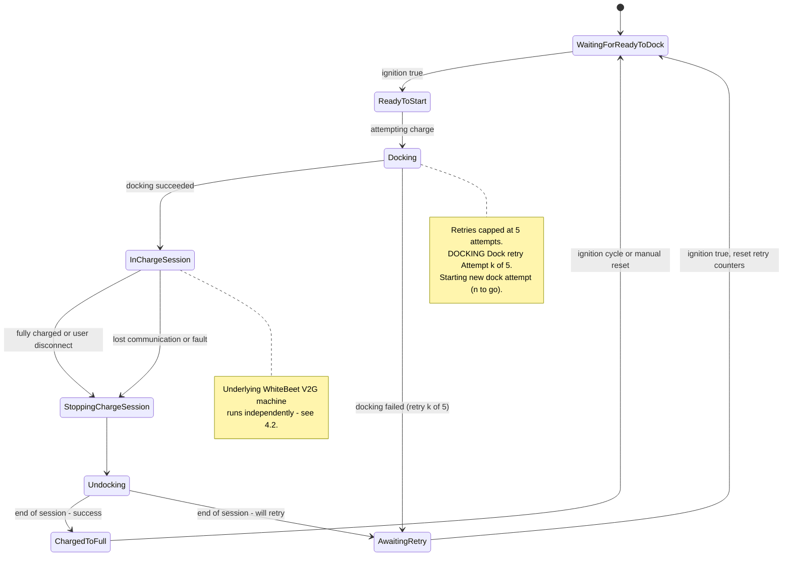
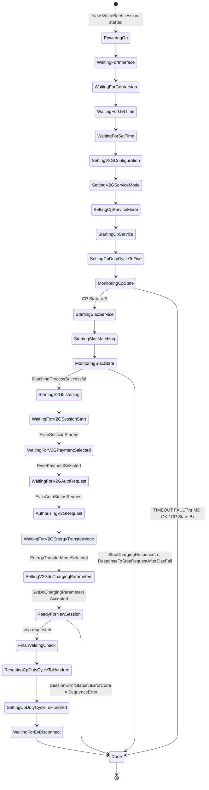
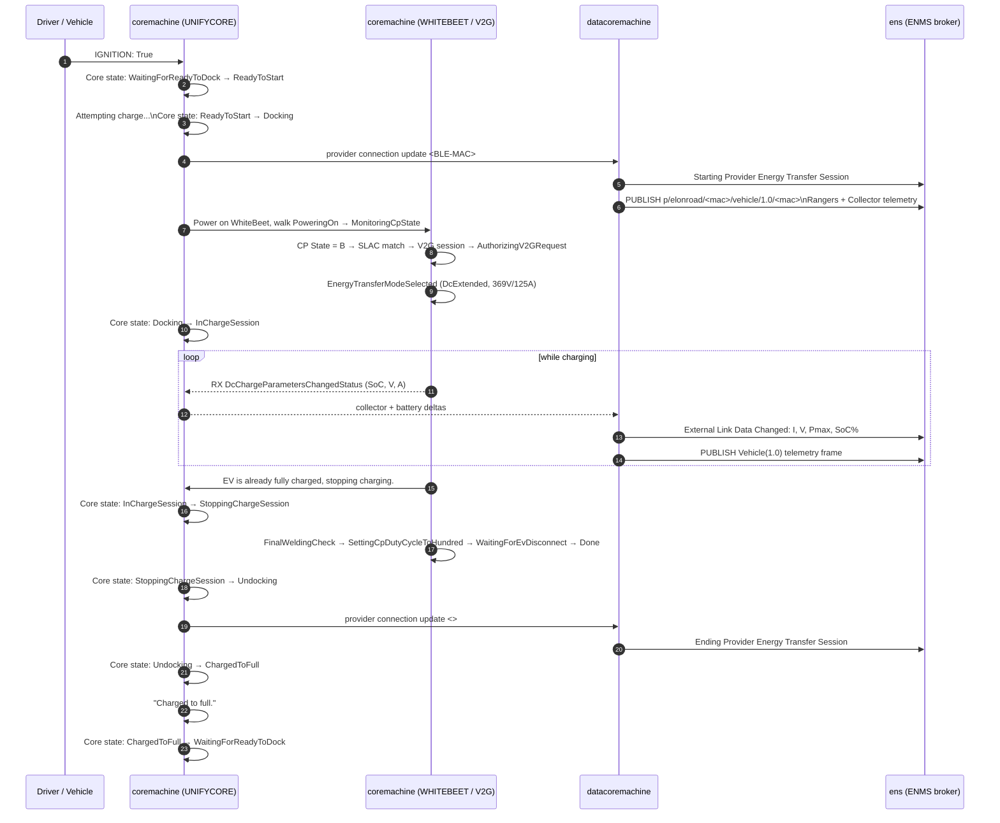
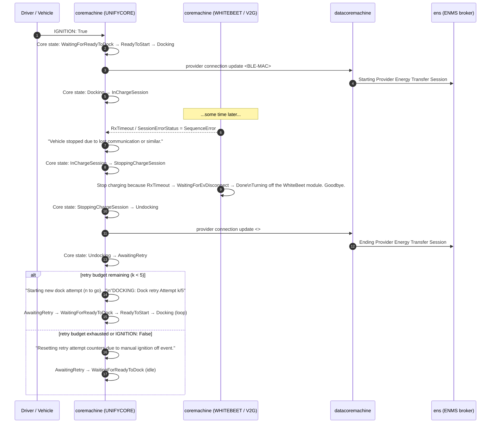
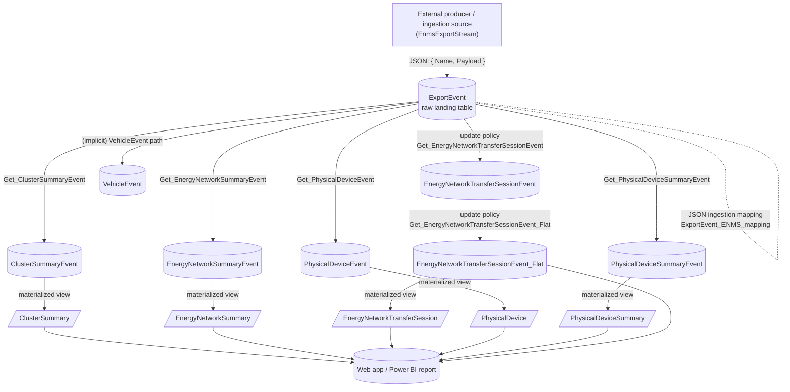

# ElonRoad Logs — Know-How

> Working notes on the journal logs emitted by an ElonRoad auto-charger (AC) and shipped to Loki. Derived from the three sample dumps in `samplelogs/` (`rpi-m1-ac-14-006`, 2026-05-22 08:00–08:16 UTC) plus the briefings in `welcome-docs/`.

## Summary

A vehicle ("auto-charger", AC) is a Raspberry-Pi-based on-board controller that drives an electrified rail/track to top up the vehicle's traction battery while driving or stopped. Three systemd services on the AC push journal logs to Loki (host `192.168.4.66`, port `3100`); one newer AC (`rpi-m1-ac-14-006`) additionally pushes Prometheus metrics prefixed `elonroad_ac_*` via Alloy/OTLP.

The three services are independent processes — they do **not** chain through each other for logs. Two Alloy instances are involved:

- **Alloy on the Pi** — tails systemd journal via `loki.source.journal.systemd_journal` and pushes log entries directly to Loki on the server. Separately, it exports OTLP metrics (newer `datacoremachine` only) over gRPC to the server-side Alloy.
- **Alloy on the server** (`192.168.4.66:12345` UI) — receives OTLP gRPC on `:4317`, batches, and writes into the co-located Prometheus via `prometheus.remote_write` to `http://127.0.0.1:9090/api/v1/write`. Config in `welcome-docs/README.md` §"Alloy configuration".

```
   coremachine ─────┐
   datacoremachine ─┴──► journald ──► Alloy (Pi) ──HTTP push──► Loki :3100
                                            │
                                            │ (newer datacoremachine only)
                                            └──OTLP gRPC──► Alloy (server :4317) ──remote_write──► Prometheus :9090
                                                                                                          │
                                                                                                          ▼
                                                                                                   Grafana :3000
                                                                                                   (reads both Loki + Prometheus)

   ens (dev-only, co-located on the same Pi) ──► journald ──► Alloy (Pi) ──► Loki :3100
       └─ subscribes from the MQTT broker to observe what datacoremachine publishes;
          will not exist on production ACs.
```

Server-side ports on `192.168.4.66`: Grafana `:3000`, Prometheus `:9090`, Loki `:3100`, Alloy UI `:12345`.

The MQTT broker (Azure Event Grid) is on a separate axis — it is the **data plane** between `datacoremachine` (publisher) and `ens` (subscriber), not part of the log or metric path.

Caveats: the Pi-side Alloy config is not in this repo (inferred from the metrics arriving in Prometheus). The server-side OTLP receiver block is commented `// OTLP receiver for LocalStaticSupport metrics`; the exact route for `elonroad_ac_*` from `datacoremachine` should be verified against the actual Pi-side config before relying on it.

| Service | Role | Best source for |
| --- | --- | --- |
| `coremachine` | Local state machine on the AC. Owns docking, collector motors, BLE link to the rail, and the WhiteBeet (ISO 15118 / CCS / V2G) stack. | Session lifecycle on the AC side, ignition, rail discovery, electrical telemetry, V2G state. |
| `datacoremachine` | Bridge between the local hardware and the remote ENS over MQTT. | Provider-side session lifecycle, external link telemetry, outgoing MQTT publishes. |
| `ens` | **Dev-only listener co-located on the AC.** Subscribes from the same MQTT broker to log the Vehicle(1.0) telemetry that `datacoremachine` publishes. Not present on production ACs — the real ENMS runs in the backend. | Reconstructing what was published (full pretty-printed JSON), broker connection state, Vehicle identity as seen end-to-end. |

Every Loki entry has the same shape:

```json
{
  "line":      "<one physical line of the original log>",
  "timestamp": "<nanoseconds since epoch, string>",
  "date":      "<ISO-8601 UTC>",
  "fields": {
    "host_name":      "rpi-m1-ac-14-006",
    "service_name":   "coremachine" | "datacoremachine" | "ens",
    "unit":           "<systemd unit>.service",
    "job":            "loki.source.journal.systemd_journal",
    "detected_level": "info" | "warn" | "fail" | "unknown"
  }
}
```

> **Gotcha:** multi-line payloads (notably the Vehicle(1.0) JSON inside `ens`) are split into **one Loki entry per physical line**. When the array is sorted newest-first, those payloads appear reversed top-to-bottom. To reconstruct a payload, group consecutive entries by service+unit and reverse the slice.

### Identifier cheatsheet

| What | How it shows up | Example |
| --- | --- | --- |
| AC / vehicle host (device) | Loki label `host_name`; Prometheus label `instance` | `rpi-m1-ac-14-006` |
| Vehicle MAC (the AC's identity on MQTT) | MQTT client name in `CONNECT TO ... as`, MQTT topic segment, `Id =` on incoming messages, `Address` in payloads | `2ccf678f5478` / `2CCF678F5478` |
| Rail / track (the electrified infrastructure) | `rail-<12hex>` in `V-ADAPTER` logs; BLE MAC in `Connecting to Rail`; `Rangers[].Tracks[].Identifier` in Vehicle payload | `rail-b42c30bd9e7c` ⇔ `7C:9E:BD:30:2C:B6` |
| Session correlation | `CorrelationId` in Vehicle payload; `RX IdentityMessage: Identity = ...` on the WhiteBeet | `00000000-0000-00d4-150a-2ccf67a8086d` |

## `coremachine`

The on-device orchestrator. The log lines are namespaced by an in-process component tag in square brackets, e.g. `UNIFYCORE[0]`, `WHITEBEET[0]`, `V-ADAPTER[0]`, `COLLECTOR[0]`, `BLUETOOTH[0]`, `ICMONITOR[0]`. The `[0]` is an instance index — only one of each exists on a single AC in the sample.

- **UNIFYCORE** — top-level state machine that decides when to dock, charge, and undock. Its `Core state changed from X to Y` lines are the canonical timeline for a session. Also emits `IGNITION: True|False` and human-readable outcomes (`Charged to full.`, `Vehicle fully charged or user disconnect.`, `Vehicle stopped due to lost communication or similar.`, `Resetting retry attempt counters due to manual ignition off event.`).
- **V-ADAPTER** — BLE link to the rail. Discovers rails (`Rail found: rail-<hex> @ N cm (RAW: x) (RSSI: y)`), connects (`Connecting to Rail <BLE-MAC>`), and runs its own state machine (`NEW ADAPTER STATE: ScanningForRail | RailNegotiation | PreConnectionPause | VerifyConnection | WaitingForIgnition | InSession | RescanningRail | EndingSession | Initializing`). Also reports BLE health (`RESETTING BLUETOOTH`, `RESETTING DBUS`) and a Google Maps link with the current speed.
- **WHITEBEET** — driver for the In-Circuit ISO 15118 / CCS / V2G module. Walks a long power-up sequence (`WaitingForInterface → WaitingForGetVersion → WaitingForGetTime → SettingV2GConfiguration → … → MonitoringCpState`) and reports electrical state (`StateChangedStatus: State = B`, `EnergyTransferModeSelectedStatus: StateOfCharge = 100% MaxVoltage = 369V MaxCurrent = 125A SelectedMode = DcExtended`, `DcChargeParametersChangedStatus`, `SessionStoppedStatus: ClosureType = Terminated`). Failure paths surface as `TIMEOUT FAULT: …` or `SessionErrorStatus: ErrorCode = SequenceError`.
- **COLLECTOR** — current-collector arm/motors. Reports sensor edges (`Collector sensors changed: LU[ ] RU[ ] - LD[*] RD[*]`), per-motor max currents, and timing (`Motors stopped after 4368 4368 ms`, `RIGHT_MOTOR completed Downing`).
- **BLUETOOTH** — low-level BlueZ glue: adapter acquisition, MTU, characteristic notify handles.
- **ICMONITOR** — periodic electrical sampling: `CURRENT MEASUREMENT: (V1/V2/V3) V  (-A1/A2) A`.

The systemd unit is `coremachine.service`; log lines start with `MM/DD HH:MM:SS level: COMPONENT[N] …` in the AC's local time. The Loki `date` field is UTC and corresponds to **journal ingest time**, which can lag the in-message timestamp by a few seconds.

## `datacoremachine`

The bridge service. Reads local state, packages it as Vehicle(1.0) MQTT messages, and pushes them to the remote ENS broker (`mqtt-dev-sweden-01.swedencentral-1.ts.eventgrid.azure.net:8883` in the sample).

- **`ENS-MQTT[0] PUBLISH: Topic = p/elonroad/<vehicle-mac>/vehicle/1.0/<vehicle-mac> Payload = {...}`** — every published telemetry frame. Payload is single-line JSON containing at minimum `Rangers[].Tracks[].{Identifier,Distance.Meters,Quality.Percent}`; richer payloads (battery, collector, CCS) ride the same channel.
- **`Starting Provider Energy Transfer Session` / `Ending Provider Energy Transfer Session`** — the provider-facing session boundary. These bracket the period in which the AC is actually drawing energy from a specific rail.
- **`Device received update on provider connection to <BLE-MAC>.`** — the rail the AC is currently bound to. Empty angle brackets (`<>`) mean disconnected.
- **`External Link Data Changed: a, b, c, d`** — periodic external-link telemetry. Field order observed: `current_A, voltage_V, max_power_W, SoC_percent` (e.g. `0, 0, 10000, 87`). Treat the unit interpretation as a working hypothesis until cross-checked against Prometheus.
- **`Device received update on unsupported connection to <Provider>.`** (warn) — connection type the parser does not handle; benign in the sample.

There is also a newer version of `datacoremachine` (not yet merged as of 2026-05-12) running on `rpi-m1-ac-14-006` that emits Prometheus metrics under `elonroad_ac_*` via OTLP. That code path is the source of the metrics dump in `welcome-docs/test-data/metrics_rpi-m1-ac-14-006.json`.

## `ens`

A **dev-only** MQTT subscriber co-located on the AC. It connects to the same Azure Event Grid broker as `datacoremachine`, receives the Vehicle(1.0) frames the AC just published, and writes them to journald — so we can see, in Loki, exactly what the broker is carrying. It is not the production ENMS; the real ENMS lives in the backend, and on-Pi `ens` will be removed in the next vehicle/charger generation (per `welcome-docs/README.md`).

- **Connection state machine** — `ENMS Connection state: Disconnected -> Connecting -> Connected` (and the failure variant `Connecting -> Disconnected` followed by `Failed to connect to remote ENMS, waiting 5 seconds...`). The `CONNECT TO: <broker> as <vehicle-mac>` line names the MQTT client.
- **Inbound messages** — `Incoming mqttMessage from Client = <client-uuid> Type = Vehicle(1.0) Id = <vehicle-mac>` for vehicle telemetry, or `Type = Ens(1.0)` for ENMS-originated control. Each is followed by a multi-line pretty-printed JSON payload, **one line per Loki entry**.
- **Persistence pipeline** — `Update device collection...` → `Getting Vehicle device from repository...` → `Getting Vehicle / <vehicle-mac>` → `Message processed!  Queueing for persistance...` (or `Message processed but nothing changed...`).

### Vehicle(1.0) payload — top-level keys observed

```
Rangers[].Tracks[].{Identifier, Distance.Meters, Quality.Percent}
BatteryInfo.{StateOfCharge.Percent, Current.Amps, Voltage.Volts}
Collector.{
  State,                              // Undocked, Docking, Docked, Undocking, …
  TargetPosition.{Vertical, FrontHorizontal, RearHorizontal}.Percent,
  ActualPosition.{Vertical, FrontHorizontal, RearHorizontal}.Percent,
  LimitSensors[].IsHigh,
  Motors[].{Current.Amps, OutputVoltage.Volts, CurrentLimit.Amps,
            RunTime.Milliseconds, PeakCurrent.Amps,
            DutyCycle.Percent, ErrorState},
  MotorPowerRelay.Closed
}
CcsController.{ State, CpState, RequestingStop, StopReason, StopDetails, Result }
Demand.{ Current.Amps, Voltage.Volts, MaxPower.Watts, Duration.Milliseconds,
         Storage.{ StateOfCharge.Percent, TargetSoC.Percent,
                   TimeToTargetSoC.Milliseconds, TotalCapacity.WattHours,
                   EnergyMix.Mix[] } }
CurrentLimit.Amps
AuxiliaryVoltage.Volts
CpuLoad, CpuTemperature.Celsius
Coordinate, Course.Degrees, Altitude
DeviceMetrics{...}
CorrelationId, ContractVersion, CustomData{...}, Address
```

## Charging flows

The diagrams below use Mermaid; rendering is supported by GitHub, the VS Code "Markdown Preview Mermaid Support" extension, and most MDX setups via `@theguild/remark-mermaid` or the `mermaid` React component.

### 4.1 — `coremachine` UNIFYCORE state machine (single-service view)

This is what the AC believes is going on, regardless of what MQTT/ENS thinks.



**Branch coverage**

- **Happy path:** `WaitingForReadyToDock → ReadyToStart → Docking → InChargeSession → StoppingChargeSession → Undocking → ChargedToFull → WaitingForReadyToDock`. Trigger for `StoppingChargeSession` is `Vehicle fully charged or user disconnect.` Final transition is logged as `Charged to full.`
- **Fault / retry path:** `… → InChargeSession → StoppingChargeSession → Undocking → AwaitingRetry → WaitingForReadyToDock`. Trigger is `Vehicle stopped due to lost communication or similar.` Then UNIFYCORE will eventually retry up to 5 docking attempts (`Dock retry Attempt N/5`, `Starting new dock attempt (k to go)...`).
- **Docking-stage failure:** If `Docking` never reaches `InChargeSession` (e.g. WHITEBEET emits `TIMEOUT FAULT: Timed out waiting for IMD OK and CP State B in state: <MonitoringCpState>.`), V-ADAPTER reports `Time to stop charge attemps. Ignition = False.` and the state goes to `AwaitingRetry`.
- **Ignition-off interrupt:** Any `IGNITION: False` while in `WaitingForReadyToDock`/`ReadyToStart` keeps UNIFYCORE idle and emits `Resetting retry attempt counters due to manual ignition off event.` on the next `IGNITION: True`.

### 4.2 — WHITEBEET (ISO 15118 / CCS / V2G) sub-state machine

Lives inside the `InChargeSession` macro-state above. Logged as `WHITEBEET[0] NEW STATE: …`.



Salient telemetry observed alongside these transitions:

- `RX EnergyTransferModeSelectedStatus: StateOfCharge = 100% MaxVoltage = 369V MaxCurrent = 125A SelectedMode = DcExtended EnergyCapacity = 0 Ready = True ErrorCode = NoError DepartureTime = 0`
- `RX DcChargeParametersChangedStatus: StateOfCharge = 100% TargetVoltage = 0V TargetCurrent = 0A`
- `EV is already fully charged, stopping charging.`
- `Stop charging because RxTimeout ()` followed by `Setting WaitingForEvDisconnect timer after RxTimeout ...`
- `RX SessionStoppedStatus: ClosureType = Terminated`, then `Turning off the WhiteBeet module.` and `Goodbye.`

### 4.3 — Combined `coremachine` + `datacoremachine` flow (happy path)

Cross-service view of a single successful charging session, taken from the second attempt in the sample (08:10:11 → 08:11:22 UTC).



### 4.4 — Combined flow — fault & retry branch

What happens when the V2G link drops mid-session (first attempt in the sample, 08:02:30 → 08:03:43 UTC).



### 4.5 — Observed session timeline (the two sessions in the sample)

Cross-checking the two attempts on `rpi-m1-ac-14-006` against rail `7C:9E:BD:30:2C:B6`:

| t (UTC) | `coremachine` | `datacoremachine` |
| --- | --- | --- |
| 08:02:30 | Attempting charge; ReadyToStart → Docking | Starting Provider Energy Transfer Session; provider → `7C:9E:BD:30:2C:B6` |
| 08:02:35 | Docking → InChargeSession | |
| 08:03:35 | Vehicle stopped due to lost communication…; InChargeSession → StoppingChargeSession | |
| 08:03:41 | Undocking → AwaitingRetry | Ending Provider Energy Transfer Session; provider → `<>` |
| 08:10:11 | Attempting charge; ReadyToStart → Docking | Starting Provider Energy Transfer Session; provider → `7C:9E:BD:30:2C:B6` |
| 08:10:15 | Docking → InChargeSession | |
| 08:11:16 | InChargeSession → StoppingChargeSession → Undocking | |
| 08:11:21 | | Ending Provider Energy Transfer Session; provider → `<>` |
| 08:11:22 | Undocking → ChargedToFull; "Charged to full." | |

### 4.6 — Log ↔ metric correlation

Sessions are detected in Loki; per-second electrical telemetry lives in Prometheus. There is no shared session ID across the two stores today.

- **Host join:** Loki label `host_name` ⇔ Prometheus label `instance` (both `rpi-m1-ac-14-006` in the sample). Trivial.
- **Session join (time-window):**
  1. In Loki, bracket the session using `coremachine` UNIFYCORE transitions — `Core state: Docking → InChargeSession` opens it; `Undocking → ChargedToFull` (success) or `Undocking → AwaitingRetry` (fault) closes it. See §4.5 for the observed pair on `rpi-m1-ac-14-006`.
  2. Query `elonroad_ac_*{instance="<host>"}` over that exact `[start, end]` from Prometheus.
  3. Tag the resulting slice with the `CorrelationId` from the Vehicle(1.0) payload to give the session a stable label inside the API.

`CorrelationId` is not a Prometheus label (and probably shouldn't be — high cardinality). A cleaner long-term option is for `datacoremachine` to emit `CorrelationId` as a metric **exemplar** on the relevant counters/histograms, giving a direct log↔metric link without the time-window step. Open question for hardware — tracked as item A.2 in `hardware-meeting-prep.md`.

## Existing Microsoft Fabric implementation

The current ENMS analytics stack is hosted in Microsoft Fabric: a Real-Time Intelligence Eventhouse (KQL database) named `Events` inside the `ITS standard …` workspace, fed by an Eventstream called `EnmsExportStream`. A web app reads the flattened tables/materialized views at the bottom of the pipeline.

**Reverse-engineering goal:** replicate the same outputs in a Python REST API that reads logs/metrics directly from Loki/Prometheus (or from a replacement message bus), so we can drop Fabric and serve queries with lower latency and lower cost.

### 6.1 — Eventhouse layout

`KQL databases › Events › Tables` (from screenshot):

| Table | Role |
| --- | --- |
| `ExportEvent` | Raw landing table. Every external event arrives as JSON `{ "Name": "...", "Payload": { … } }` and is parsed into typed columns by the **`ExportEvent_ENMS_mapping`** ingestion mapping. |
| `ClusterSummaryEvent` | Per-cluster (fleet / tenant) summary events. Columns observed: `Name`, `Timestamp`, `ExportEventName`, `Id`, `State`, `Details`, `IngestionTime`. Sample IDs: `TenantEnergyNetworks`, `its-longbeach-fleet`. `ExportEventName` values seen: `Changed`. |
| `EnergyNetworkSummaryEvent` | Per-network rollups (energy delivered, sessions, etc.). |
| `EnergyNetworkTransferSessionEvent` | Session-level events — the central entity for "how much energy moved between which devices". |
| `EnergyNetworkTransferSessionEvent_Flat` | Flattened/denormalised projection of the above for direct consumption by the web app and Power BI. |
| `PhysicalDeviceEvent` | Hardware-level events for each AC / rail / cabinet. |
| `PhysicalDeviceSummaryEvent` | Periodic rollups per device. |
| `VehicleEvent` | Vehicle (auto-charger) events. |

`KQL databases › Events › Materialized views`:

| Materialized view | Backing table |
| --- | --- |
| `ClusterSummary` | `ClusterSummaryEvent` (latest-state projection) |
| `EnergyNetworkSummary` | `EnergyNetworkSummaryEvent` |
| `EnergyNetworkTransferSession` | `EnergyNetworkTransferSessionEvent` / `…_Flat` |
| `PhysicalDevice` | `PhysicalDeviceEvent` |
| `PhysicalDeviceSummary` | `PhysicalDeviceSummaryEvent` |

`KQL databases › Events › Functions` (KQL UDFs invoked by update policies):

- `Get_ClusterSummaryEvent`
- `Get_EnergyNetworkSummaryEvent`
- `Get_EnergyNetworkTransferSessionEvent`
- `Get_EnergyNetworkTransferSessionEvent_Flat`
- `Get_PhysicalDeviceEvent`
- `Get_PhysicalDeviceSummaryEvent` _(name truncated in UI; inferred from sibling tables)_

### 6.2 — Ingestion → projection chain



**Reading the chain:** every `Get_*` function is the body of a Kusto **update policy** attached to its target table — when new rows land in the source (`ExportEvent` for the first hop, `EnergyNetworkTransferSessionEvent` for the second), Fabric runs the function over the delta and appends the projection. Materialized views then maintain the latest-state / aggregated view that the web app actually queries.

### 6.3 — Artefacts we still need to extract from Fabric

Before we can port this to Python we need to capture:

1. The **`ExportEvent` schema** (column names + types) — fetched via `.show table ExportEvent schema` or the "Edit schema" pane.
2. The **`ExportEvent_ENMS_mapping`** JSON ingestion mapping — `.show table ExportEvent ingestion json mappings` and copy the `ExportEvent_ENMS_mapping` body.
3. Every **`Get_*` KQL function** — `.show function Get_EnergyNetworkTransferSessionEvent` etc. These contain the actual parsing/projection logic and are the most important deliverable to reverse-engineer.
4. Every **update policy** — `.show table <T> policy update` for each of the seven event tables — tells us source-table, function, `IsTransactional`, `PropagateIngestionProperties`.
5. Every **materialized view definition** — `.show materialized-view <MV> details`.
6. The **`EnmsExportStream` source binding** (Eventstream): protocol, schema contract, and the upstream producer identity (which service is calling Fabric's ingestion endpoint and from where).
7. A sample of representative **`Payload`** values for each distinct `Name` — we'll need these as fixtures when validating the Python parser.
8. The list of **queries the web app actually issues** (Power BI semantic model and/or any KQL behind the app), so the Python REST API can mirror exactly the shape the consumers depend on.

### 6.4 — Target Python REST API — working sketch

## Data analysis

_Stub — not yet written. Planned subsections:_

- Session detection & deduplication across services
- Energy delivered per session (Joules from `dc_meter_input_joules_total` deltas vs. WhiteBeet payload)
- Rail utilisation and contention
- Failure-mode taxonomy (RxTimeout, SequenceError, dock retries, BLE resets)
- Metric ↔ log correlation for `rpi-m1-ac-14-006`
