# Loki charging session flow

Acest document descrie cum luam acum charging sessions din datele brute de Loki si cum le transformam in datele folosite de UI.

Flow-ul este diferit de Fabric `_Flat`: in Loki pornim de la loguri brute `datacoremachine.service`, nu de la o tabela deja flattenata.

## Pe scurt: ce luam, ce filtram, ce matchuim

### Ce date luam

Luam loguri brute din Loki, din stream-ul:

```logql
{unit="datacoremachine.service"} |= "Payload" |= "Session"
```

Din fiecare log line luam:

| Date | De unde vin | La ce le folosim |
| --- | --- | --- |
| `timestamp` | timestamp-ul Loki | `sampled_at` |
| `host_name` | label Loki | fallback/debug; nu il mai folosim ca charger daca avem `RemoteDevice` |
| `unit` | label Loki | filtram doar `datacoremachine.service` |
| `topic` | textul din log line MQTT publish | extragem device type si vehicle id |
| `Payload` | JSON din log line | sursa pentru session, SoC, energie, charger |
| `EnergyLink.State` | `Payload.EnergyLink.State` | stim daca era connected/disconnected |
| `TransferSession` | `Payload.EnergyLink.TransferSession` | obiectul principal de charging session |
| `Session` | `Payload.Session` | fallback pentru session id/start |

### Ce filtram

Filtrare in query Loki:

```text
unit trebuie sa fie datacoremachine.service
linia trebuie sa contina Payload
linia trebuie sa contina Session
```

Filtrare in parser:

```text
trebuie sa putem extrage Payload JSON valid
trebuie sa existe session id: TransferSession.RemoteDevice.CorrelationId sau Session.Id
trebuie sa existe session start: TransferSession.Start sau Session.Start
```

Filtrare in agregare backend:

```text
sesiunile cu energy_kwh <= 0 sunt ignorate
```

Filtrare in UI:

```text
sesiunile cu endSoC <= startSoC sunt ascunse din liveSessions
```

Motivul filtrarii UI: pentru dashboard energia vizibila este aliniata cu delta SoC. Daca Loki trimite `55% -> 55%` dar `ReceivedEnergy` creste, acea sesiune ar aparea ca `0 kWh` in UI si creeaza confuzie.

### Ce matchuim

Matching-ul principal este:

| Entitate UI | Camp sursa Loki | Regula |
| --- | --- | --- |
| Vehicle | MQTT topic | `topic_device_id` din `p/<network>/<sender>/<device_type>/<version>/<device_id>` |
| Vehicle name | `Payload.CustomData.VehicleName` | daca lipseste, UI afiseaza vehicle id |
| Vehicle type | `Payload.CustomData.VehicleType` sau topic device type | fallback la `vehicle` din topic |
| Charger | `TransferSession.RemoteDevice.Name` | luam suffix-ul din `rail/1.0/<charger_id>` |
| Session id | `TransferSession.RemoteDevice.CorrelationId` | fallback la `Payload.Session.Id` |
| Session start | `TransferSession.Start` | fallback la `Payload.Session.Start` |
| Session key | `CorrelationId + TransferSession.Start` | separa sesiuni care refolosesc acelasi correlation id |
| Start SoC | `TransferSession.LocalSoCRange.Min.Percent` | min peste toate snapshoturile sesiunii |
| End SoC | `TransferSession.LocalSoCRange.Max.Percent` | max peste toate snapshoturile sesiunii |
| Energy | `TransferSession.ReceivedEnergy` / `SuppliedEnergy` | maximul observat in sesiune, convertit Wh -> kWh |
| End time | `TransferSession.End` | fallback la ultimul `sampled_at` |

### Exemplu de matching

Raw topic:

```text
p/its/2ccf67fae91c/vehicle/1.0/2ccf67fae91c
```

Rezultat:

```text
vehicle_id = 2ccf67fae91c
vehicle_type = vehicle
```

Raw remote device:

```json
{
  "Name": "rail/1.0/2ccf67fae910",
  "DeviceType": "rail",
  "CorrelationId": "00000000-0000-002c-150a-2ccf67fae910"
}
```

Rezultat:

```text
charger_id = 2ccf67fae910
session_id = 00000000-0000-002c-150a-2ccf67fae910
```

Raw transfer start:

```text
TransferSession.Start = 2026-05-27T17:54:38.409340Z
```

Rezultat:

```text
session_key = 00000000-0000-002c-150a-2ccf67fae910::2026-05-27T17:54:38.409340Z
```

## Diagrama principala

```mermaid
flowchart LR
    DataCore["DataCoreMachine / datacoremachine.service<br/>ruleaza pe device/controller local"]
    Mqtt["MQTT publish payload<br/>JSON cu Device, EnergyLink, Session"]
    Log["Log line<br/>PUBLISH topic=... Payload={...}"]
    Alloy["Grafana Alloy / Loki push endpoint"]
    Loki["Loki<br/>log stream labels + raw line"]
    Backend["Backend Loki repository<br/>query + parse raw payload"]
    Snapshots["loki_vehicle_snapshots<br/>raw normalized snapshots"]
    Aggregates["charging_session_summaries<br/>vehicle_daily_aggregates<br/>charger_daily_aggregates"]
    UI["Lovable UI<br/>sessions, charts, filters"]

    DataCore --> Mqtt
    Mqtt --> Log
    Log --> Alloy
    Alloy --> Loki
    Loki --> Backend
    Backend --> Snapshots
    Snapshots --> Aggregates
    Aggregates --> UI
```



## 1. Sursa din device

In stack-ul local, `datacoremachine.service` publica payloaduri MQTT si le scrie in log.

Payloadul contine obiecte de stare precum:

```text
Device
EnergyLink
EnergyLink.TransferSession
Session
BatteryInfo
Meter
CustomData
```

Pentru charging sessions ne intereseaza in special:

```text
EnergyLink.State
EnergyLink.TransferSession.RemoteDevice.CorrelationId
EnergyLink.TransferSession.RemoteDevice.Name
EnergyLink.TransferSession.Start
EnergyLink.TransferSession.End
EnergyLink.TransferSession.LocalSoCRange
EnergyLink.TransferSession.ReceivedEnergy
EnergyLink.TransferSession.SuppliedEnergy
Session.Id
Session.Start
```

## 2. Cum ajunge in Loki

Alloy primeste logurile/push-urile edge si le trimite in Loki.

Config-ul Alloy observat pentru loguri:

```hcl
loki.source.api "edge_logs" {
  http {
    listen_address = "0.0.0.0"
    listen_port    = 3100
  }
  forward_to = [
    loki.write.local.receiver,
    loki.relabel.cloud_filter.receiver,
  ]
}

loki.write "local" {
  endpoint {
    url = "http://127.0.0.1:3101/loki/api/v1/push"
  }
}
```

In Loki, datele sunt log lines. Nu sunt tabele structurate ca in Fabric.

## 3. Query-ul Loki folosit de backend

Repository-ul Loki cauta logurile `datacoremachine.service` care contin payload de publish si sesiune.

Selectorul generic:

```logql
{unit="datacoremachine.service"} |= "Payload" |= "Session"
```

Daca se filtreaza pe host:

```logql
{host_name="<host>", unit="datacoremachine.service"} |= "Payload" |= "Session"
```

Backend-ul cere un range de timp, primeste log lines si parseaza fiecare linie.

## 4. Ce extragem din raw log line

Din linia Loki extragem:

```text
topic
Payload JSON
labels Loki
timestamp Loki
```

Topicul MQTT are forma aproximativa:

```text
p/<network>/<sender>/<device_type>/<version>/<device_id>
```

Exemplu:

```text
p/its/2ccf67fae91c/vehicle/1.0/2ccf67fae91c
```

Din topic luam:

```text
topic_device_id = device_id
vehicle_type = device_type
```

Din `TransferSession.RemoteDevice.Name` luam charger-ul real:

```text
rail/1.0/2ccf67fae910
```

devine:

```text
charger_id = 2ccf67fae910
```

Astfel UI-ul nu mai foloseste `rpi-*` ca charging station.

## 5. Normalizarea in `loki_vehicle_snapshots`

Fiecare log valid devine un rand normalizat in:

```text
loki_vehicle_snapshots
```

Campuri importante:

```text
tenant_key
source
host_name
unit
sampled_at
topic
topic_device_id
session_id
session_started_at
vehicle_name
vehicle_type
energy_link_state
device_state
battery_soc_percent
labels
payload
```

Pentru Loki:

```text
source = loki
unit = datacoremachine.service
tenant_key = loki
```

`labels` pastreaza si:

```text
remote_device_id
remote_device_name
```

## 6. Cheia de sesiune

Pentru a evita combinarea gresita a sesiunilor care refolosesc acelasi `CorrelationId`, cheia agregata este:

```text
session_key = CorrelationId + TransferSession.Start
```

In DB apare sub forma:

```text
<correlation_id>::<transfer_session_start>
```

Exemplu:

```text
00000000-0000-002c-150a-2ccf67fae910::2026-05-27T17:54:38.409340+00:00
```

Aceasta regula e importanta pentru Loki, pentru ca pot exista mai multe transferuri cu acelasi correlation id in timp, iar `Start` separa sesiunile.

## 7. Agregarea in `charging_session_summaries`

Agregarea grupeaza snapshoturile dupa:

```text
tenant_key
session_key
vehicle_id
charger_id
```

Pentru fiecare sesiune se calculeaza:

```text
started_at = primul TransferSession.Start / primul sampled_at
ended_at = TransferSession.End daca exista, altfel ultimul sampled_at
duration_minutes = ended_at - started_at
energy_kwh = energia maxima observata in ReceivedEnergy/SuppliedEnergy
start_soc_percent = min(LocalSoCRange.Min.Percent)
end_soc_percent = max(LocalSoCRange.Max.Percent)
sample_count = numarul de log lines din sesiune
state_counts = distributia EnergyLink.State / device state
```

Pentru charger:

```text
charger_id = TransferSession.RemoteDevice.Name suffix
```

Fallback:

```text
charger_id = host_name
```

Fallback-ul ar trebui sa fie rar acum, pentru ca vehicle events contin `RemoteDevice.Name`.

## 8. Filtrare pentru UI

Backend-ul filtreaza sesiunile fara energie utila:

```text
energy_kwh <= 0
```

UI-ul mai filtreaza sesiunile care ar aparea ca 0 in dashboardul bazat pe SoC:

```text
endSoC <= startSoC
```

Motiv: in Loki am vazut cazuri in care `ReceivedEnergy` creste, dar `LocalSoCRange` ramane blocat, de exemplu:

```text
55% -> 55%
90% -> 90%
```

Aceste randuri ar produce `0 kWh` vizual daca UI-ul calculeaza energia din delta SoC, deci sunt ascunse din `liveSessions`.

## 9. Exemplu Loki valid

Exemplu observat:

```text
topic = p/bring/d83add09fddd/vehicle/1.0/d83add09fddd
host_name = rpi-m1-ac-14-020
vehicle_id = d83add09fddd
vehicle_name = BRING 1
session_id = 00000000-0000-00c7-150a-d83add09fc5d
remote_device_name = rail/1.0/d83add09fc5d
charger_id = d83add09fc5d
start = 2026-05-28T09:15:48Z
end = 2026-05-28T09:20:04Z
LocalSoCRange = 98 -> 99
ReceivedEnergy = 560 Wh
```

Rezultat in `charging_session_summaries`:

```text
tenant_key = loki
source = loki
host_name = d83add09fc5d
vehicle_id = d83add09fddd
vehicle_name = BRING 1
start_soc_percent = 98
end_soc_percent = 99
energy_kwh = 0.5602
duration_minutes = 4.27
```

## 10. Diferente fata de Fabric

| Aspect | Loki | Fabric `_Flat` |
| --- | --- | --- |
| Sursa | log lines brute | tabela flattenata derivata |
| Contract | text + JSON in log | coloane KQL |
| Filtru principal | `unit="datacoremachine.service"` si payload cu `Session` | `Name startswith "EnergyNetworkTransferSessionsEvent_"` |
| Charger | extras din `RemoteDevice.Name` | `RemoteDeviceId` deja flattenat |
| SoC | `TransferSession.LocalSoCRange` daca exista | `LocalSoCRangeMin/Max` deja coloane |
| Energie | max din `ReceivedEnergy/SuppliedEnergy` | `R_TotalEnergy_kWh` / `S_TotalEnergy_kWh` |
| Risc | payload incomplet/stale in unele loguri | flow deja curatat prin update policies |

## 11. Limitari cunoscute

1. Unele sesiuni Loki au energie, dar SoC neschimbat.

   Exemplu observat:

   ```text
   energy_kwh = 26.3536
   start_soc_percent = 55
   end_soc_percent = 55
   ```

   Pentru UI acestea sunt filtrate, deoarece ar aparea cu `0 kWh` in graficele bazate pe SoC.

2. Unele sesiuni nu au `vehicle_name`.

   In acest caz UI foloseste `vehicle_id`.

3. Daca lipseste `RemoteDevice.Name`, charger-ul poate cadea inapoi pe `host_name`.

   Dupa corectia actuala, pentru vehicle events normale ar trebui sa vedem charger ids, nu `rpi-*`.

4. Loki este gandit initial pentru diagnostics.

   Daca Loki dispare, repository pattern-ul permite inlocuirea sursei cu Fabric, Azure stream sau alt provider, pastrand acelasi model intern.

## 12. Comenzi utile de verificare

Verifica sesiunile Loki expuse de API:

```powershell
Invoke-WebRequest -UseBasicParsing -Uri http://127.0.0.1:8000/api/sessions/summaries
```

Verifica numarul de agregate pe tenant:

```powershell
docker exec api_server-api-1 python -c "from app.db import SessionLocal; from app.models import ChargingSessionSummary; db=SessionLocal(); print(db.query(ChargingSessionSummary).filter(ChargingSessionSummary.tenant_key=='loki').count()); db.close()"
```

Verifica daca mai apar `rpi-*` ca charger in session summaries:

```powershell
docker exec api_server-api-1 python -c "from app.db import SessionLocal; from app.models import ChargingSessionSummary; db=SessionLocal(); print(db.query(ChargingSessionSummary).filter(ChargingSessionSummary.tenant_key=='loki', ChargingSessionSummary.host_name.like('rpi-%')).count()); db.close()"
```

Refa agregatele Loki manual:

```powershell
docker exec api_server-api-1 python -c "from app.db import SessionLocal; from app.services.aggregate_rebuild import rebuild_ui_aggregates_in_session; db=SessionLocal(); print(rebuild_ui_aggregates_in_session(db, tenant_key='loki').as_dict()); db.commit(); db.close()"
```

## 13. Rezumat operational

Pentru Loki, flow-ul corect este:

```text
Loki raw log line
  -> parse topic + Payload
  -> extract CorrelationId, Start, End, LocalSoCRange, RemoteDevice
  -> write loki_vehicle_snapshots
  -> group by CorrelationId + Start
  -> write charging_session_summaries
  -> UI filters zero SoC delta sessions
```

Aceasta ne da acelasi tip de date de care are nevoie UI-ul, dar direct din logurile brute, fara Fabric `_Flat`.
